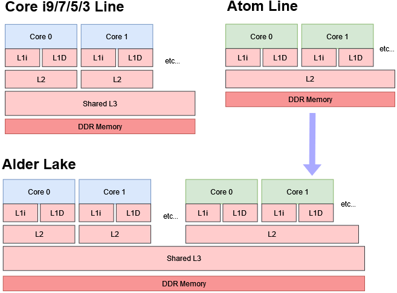

# Report on the Usage of PIPA Tool

First, use the command `pip install -e ./pipa` to install the package in editable mode to the base environment.

## Hardware Environment
- **CPU**: 12th Gen Intel(R) Core(TM) i7-12700H
  - Total cores: 14 cores (6 P Cores + 8 E Cores)
  - Total threads: 20 threads (Performance cores support hyperthreading, Efficiency cores do not)
- **GPU**: NVIDIA GeForce RTX 3050 Laptop GPU, 4096 MiB, Driver 550.120
- **Memory**: 15GB
- **Operating System**: Ubuntu 22.04.3 LTS (Jammy Jellyfish)

## Running Basic Benchmark Profiling
### Filter
First, I ran `pipa generate` directly to collect data from the stress test `perf bench futex hash`.
But I found that there were <not counted> and <not supported> columns in the output, so I added filtering of these abnormal dataframes in the visualization code.
```
# pipa/src/pipa/parser/perf_stat.py

# Handle '<not supported>' values in the 'value' column
mask = df["value"] == "<not supported>"
if mask.any():
    logger.warning(f"Found {mask.sum()} '<not supported>' values in {stat_output_path}, will set them to NaN")
    df.loc[mask, "value"] = float('nan')
    
# Handle '<not counted>' values in the 'value' column
mask_not_counted = df["value"] == "<not counted>"
if mask_not_counted.any():
    logger.warning(f"Found {mask_not_counted.sum()} '<not counted>' values in {stat_output_path}, will set them to NaN")
    df.loc[mask_not_counted, "value"] = float('nan')

```
### Collect test information on the performance core and efficient core respectively
Since the cores in my chip are divided into two architectures: performance core and efficiency core.



The information collected by the `perf -e` parameter actually uses different PUMs between P(performance) and E(efficient) cores. This is why we get a <not counted> error. For example:
```
1.003437327,CPU0,<not counted>,,cpu_atom/cycles/,0,100.00,,
1.003437327,CPU1,<not counted>,,cpu_atom/cycles/,0,100.00,,
...
1.003437327,CPU11,<not counted>,,cpu_atom/cycles/,0,100.00,,
...
1.003437327,CPU12,<not counted>,,cpu_core/instructions/,0,100.00,,
1.003437327,CPU13,<not counted>,,cpu_core/instructions/,0,100.00,,
...
1.003437327,CPU19,<not counted>,,cpu_core/instructions/,0,100.00,,
```
For better profiling, I added a way to test P(performance) or E(efficient) cores separately.
####  Add new args.
```
# pipa/src/pipa/service/gengerate/run_by_pipa.py

# Add question for hybrid cores mode
hybrid_cores = questionary.select(
    "Use hybrid cores mode (separate events for P-cores and E-cores)?\n", 
    choices=["Yes", "No"], 
    default="No"
).ask()

config["hybrid_cores"] = hybrid_cores == "Yes"
```
#### Add new code to generate scripts to perf separately on PE-cores.
```
# pipa/src/pipa/service/gengerate/run_by_pipa.py 

else:
    # For hybrid architecture with P-cores and E-cores
    if hybrid_cores:
        # Run perf on P-cores
        p_cores_range = get_core_type_range_string("p_cores")
        # Prefix each event with cpu_core/ for P-cores
        p_core_events = ",".join([f"cpu_core/{event}/" for event in events_stat.split(",")])
        f.write(
            f"perf stat -e {p_core_events} -C {p_cores_range} -A -x , -I {count_delta_stat} -o $WORKSPACE/perf-stat-pcores.csv {command} &\n"
        )
        f.write("p_cores_pid=$!\n")
        
        # Run perf on E-cores
        e_cores_range = get_core_type_range_string("e_cores")
        # Prefix each event with cpu_atom/ for E-cores
        e_core_events = ",".join([f"cpu_atom/{event}/" for event in events_stat.split(",")])
        f.write(
            f"perf stat -e {e_core_events} -C {e_cores_range} -A -x , -I {count_delta_stat} -o $WORKSPACE/perf-stat-ecores.csv {command}\n"
        )
        
        # Wait for the P-cores perf to finish
        f.write("wait $p_cores_pid\n")
        
        # Combine the results - skip first two lines of the second file
        f.write("cat $WORKSPACE/perf-stat-pcores.csv <(tail -n +3 $WORKSPACE/perf-stat-ecores.csv) > $WORKSPACE/perf-stat.csv\n")
```

#### outcome
Now we can enable the PE core to run perf instructions separately by selecting yes.
```
# sieni_test/ef/pipa-run.sh
...
perf stat -e cpu_core/cycles/,cpu_core/instructions/,cpu_core/branch-misses/,cpu_core/L1-dcache-load-misses/,cpu_core/L1-icache-load-misses/ -C 0-11 -A -x , -I 1000 -o $WORKSPACE/perf-stat-pcores.csv /usr/bin/taskset -c 0-19 perf bench futex hash

perf stat -e cpu_atom/cycles/,cpu_atom/instructions/,cpu_atom/branch-misses/,cpu_atom/L1-dcache-load-misses/,cpu_atom/L1-icache-load-misses/ -C 12-19 -A -x , -I 1000 -o $WORKSPACE/perf-stat-ecores.csv /usr/bin/taskset -c 0-19 perf bench futex hash
...
```

#### Understanding the appearance of <not supported>

By consulting the Linux 6.4 kernel source code (/arch/x86/events/intel/core.c), we found that on the x86 atom architecture, L1D RESULT_MISS is not mapped to a valid PMU event. I infer that this may be because the atom core simplifies the PMU design to save resources, so that it only collects less specific data such as the number of instructions.

```
static __initconst const u64 atom_hw_cache_event_ids
				[PERF_COUNT_HW_CACHE_MAX]
				[PERF_COUNT_HW_CACHE_OP_MAX]
				[PERF_COUNT_HW_CACHE_RESULT_MAX] =
{
 [ C(L1D) ] = {
	[ C(OP_READ) ] = {
		[ C(RESULT_ACCESS) ] = 0x2140, /* L1D_CACHE.LD               */
		[ C(RESULT_MISS)   ] = 0,
	},
	[ C(OP_WRITE) ] = {
		[ C(RESULT_ACCESS) ] = 0x2240, /* L1D_CACHE.ST               */
		[ C(RESULT_MISS)   ] = 0,
	},
	[ C(OP_PREFETCH) ] = {
		[ C(RESULT_ACCESS) ] = 0x0,
		[ C(RESULT_MISS)   ] = 0,
	},
 },
```

### Data organization and visualization
I noticed that the visualization code is a work-in-progress. I added some code so that the final summary parameter information can be stored in the json file specified by args.
```
# Custom JSON encoder to handle NumPy types
class NumpyEncoder(json.JSONEncoder):
    def default(self, obj):
        if isinstance(obj, np.integer):
            return int(obj)
        elif isinstance(obj, np.floating):
            return float(obj)
        elif isinstance(obj, np.ndarray):
            return obj.tolist()
        return super(NumpyEncoder, self).default(obj)

...

file_pth = os.path.join(args.workspace_path, args.output)
with open(file_pth, 'w') as json_file:
    json.dump(output, json_file, indent=4, cls=NumpyEncoder)

...
```

1. Run following command to get P-cores profiling data:

```
python ./sieni/visionalization.py --ef_cores \
--workspace_path /home/sieni/Desktop/working_doc/project/Zhou_ZJU/sieni_test/ef \
--num_transactions 328452000 --threads_start 0 --threads_end 12 \
--output pipashu_metrics_pcores.json \
--perf_stat_path perf-stat-pcores.csv
```

2. Run following command to get E-cores profiling data:

```
python ./sieni/visionalization.py --ef_cores \
--workspace_path /home/sieni/Desktop/working_doc/project/Zhou_ZJU/sieni_test/ef \
--num_transactions 328452000 --threads_start 12 --threads_end 20 \
--output pipashu_metrics_ecores.json \
--perf_stat_path perf-stat-ecores.csv
```

GET:
```
# sieni_test/ef/pipashu_metrics_pcores.json

...
"cycles": 391342375697.0,
"instructions": 391083418839.0,
"cycles_per_second": 43435652897.53852,
"instructions_per_second": 43406910903.57609,
...
```

```
# sieni_test/ef/pipashu_metrics_ecores.json

...
"cycles": 210959439224.0,
"instructions": 172759573417.0,
"cycles_per_second": 23417453836.96235,
"instructions_per_second": 19177095607.891884,
...
```
It can be seen that in the stress test, the cycles_per_second of P (performance)-cores is faster than that of E (efficient)-cores, and the number of instructions executed on P-cores is also greater than that of E-cores.