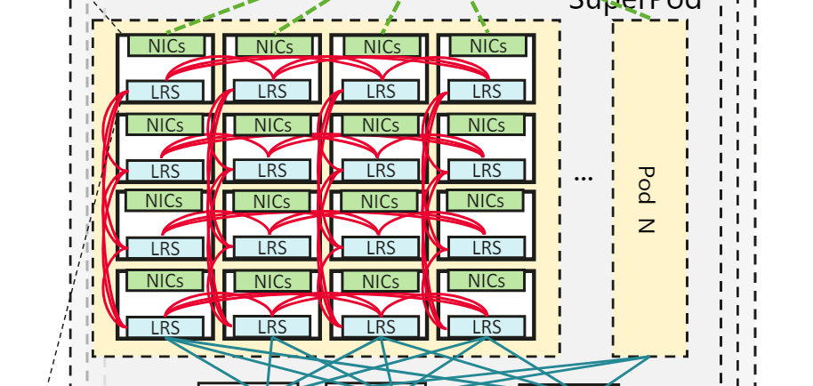
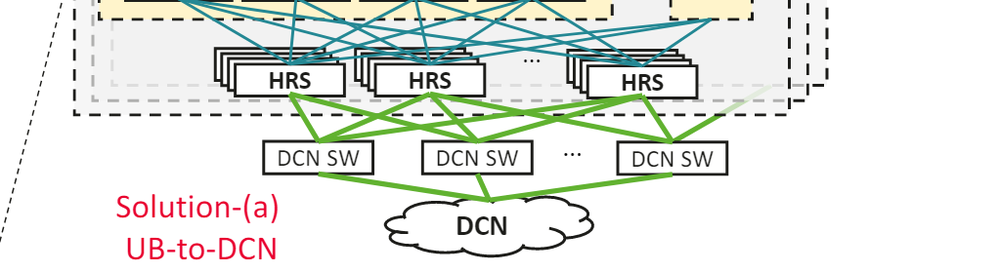
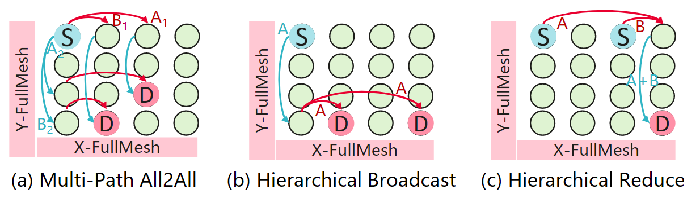

# Paper reading report to UB-Mesh: a Hierarchically Localized nD-FullMesh Datacenter Network Architecture

## 文章内容简述

《UB-Mesh: a Hierarchically Localized nD-FullMesh Datacenter Network Architecture》这篇论文提出了一种专为大规模语言模型（LLM）训练设计的新型数据中心网络架构——UB-Mesh。针对 LLM 训练对大规模计算、高带宽、成本效益和高可用性的需求，UB-Mesh 创新性地采用了 nD-FullMesh 拓扑结构，通过层次化、局部化的网络设计，结合 Unified Bus（UB）互联技术和 All-Path Routing（APR）路由机制，显著提高了性能和成本效益。论文详细阐述了 UB-Mesh 的硬件与软件架构设计，展示了其在 LLM 训练任务中的优越表现，包括 2.04 倍的成本效益提升、7.2% 的网络可用性提高以及超过 95% 的线性扩展性。相较于传统 Clos、Torus 和 DragonFly 等拓扑，UB-Mesh 更适合 LLM 训练的流量局部性和复杂通信模式，为下一代 AI 数据中心提供了创新的解决方案。

## My view

### 首先，文章的立足点

#### 1. 这个Task为什么Make Sense？
LLM 的规模和复杂性不断增长，

**Openai Scaling Laws for Neural Language Models**

As seen in Figure 2[left], architectural details like number of attention heads have laughable impact on performance. This shows that one can still change architectural details for usual reasons like hardware / memory constraints etc, but should not do it in hopes of improving performance.

传统 HPC 系统通常设计为通用性架构，旨在处理多样化的计算任务.

而 LLM 训练则表现出高度的确定性和局部化通信模式，我们可以巧妙设计来节约成本。
| Parallelism Techniques | Communication Pattern | Data Volume Per Transfer | Total Transfer | Total Volume | Data Traffic |
|-------------------------|-----------------------|--------------------------|----------------|--------------|--------------|
| TP                     | AllReduce             | 360 MB                   | 4992            | 1775 GB      | 52.9%        |
| SP                     | AllGather             | 180/360 MB               | 4992/1664       | 1462.5 GB    | 44.08%       |
| EP                     | AlltoAll               | 10.5 MB                  | 4992            | 51.19 GB     | 1.54%        |
| PP                     | P2P                    | 192 MB                   | 26              | 4.875 GB     | 0.14%        |
| DP                     | AllReduce             | 711.75 MB                | 64              | 44.48 GB     | 1.34%        |

#### 2. 这个方法为什么stand
UB-Mesh 的立足点源于 LLM 训练的独特流量模式。
> According to our analysis based on an in-house MoE-2T model, as detailed in Table 1, communication intensity is hierarchical and exhibits strong locality. Specifically, TP and SP account for approximately 97% of the total traffic, while the remaining parallelism techniques typically generate less than 2% of the total traffic. Other model architectures may exhibit slightly different data traffic distributions but also demonstrate strong locality [ 28].

我认为，UB-Mesh 的核心优势在于其对流量局部性的精准利用，通过在低维度（如板上、机架内）构建高带宽全互联网络，优先满足 TP 和 SP 的需求，而在高维度（如跨机架）分配较低带宽，适配 DP 的稀疏通信。这种层次化的带宽分配不仅提高了网络效率，还显著降低了硬件成本。

#### 3. 其他工作是怎么样
在阅读相关工作时，我发现传统拓扑如 Clos、Torus 和 DragonFly 在 LLM 训练场景下均存在明显局限。Clos 拓扑虽然提供对称带宽和灵活性，但需要大量高基数交换机和光模块。Clos 论文中提到：
>In a $v(M, L, D)$ Clos-ROADM, $2 \cdot D$ WSSs are required in the ingress and egress stages when there are $D$ directional degrees and $M$ WSSs are required in the middle stage. Thus, the total number of WSSs required is $2 \cdot D + M$.

**From Small to Large: Clos Network for Scaling All-Optical Switching**

导致成本高昂，且无法充分利用 LLM 训练的局部性流量。

### 从硬件到软件的架构理念

#### 硬件架构

**递归式的声明结构**  
UB-Mesh 的 nD-FullMesh 拓扑以递归方式构建，从板上的 1D 全互联到机架内的 2D 全互联，再到跨机架的 3D 和 4D 全互联，层层递进，结构声明简洁明了。

>it fully leverages the data locality and denseto-sparse traffic patterns inherent in LLM training

除了以上论文中提到的优势外，这种递归式结构的巧妙之处在于，它将 LLM 训练的流量局部性直接映射到物理拓扑上。例如，板上 1D 全互联通过短距离电线缆提供高带宽，完美适配 TP 和 SP 的通信需求；跨机架的 3D/4D 全互联则通过光缆支持较稀疏的 DP 通信。

**万物Unified**  
UB-Mesh 将 NPU、CPU、低基数交换机（LRS）和高基数交换机（HRS）通过统一的互联协议连接起来，形成资源池化。

这种统一互联的设计极大简化了系统复杂度，消除了传统架构中多种协议（如 PCIe、NVLink、InfiniBand）之间的转换开销。

跟进一步的，还使得系统瓶颈更容易被发现和优化。例如，UB 允许动态调整 NPU-NPU 或 CPU-NPU 的带宽分配，这种灵活性让系统能够根据不同 LLM 训练任务的需求进行自适应优化。相比之下，传统架构的协议多样性常常导致资源碎片化和调度复杂性，而 UB-Mesh 的统一互联让我看到了资源高效利用的未来可能性。

**2D x 2D = 4D**  
UB-Mesh-Pod 的 4D-FullMesh 设计是硬件架构的核心体现，每个机架内 64 个 NPU 组成 2D 全互联。

**16 个机架通过LRS再形成另一个 2D 全互联，总计 1024 个 NPU。**

**如何继续扩展or连接DCN？+ Clos!** 

> Considering that in current cloud scenarios the small or middle-scale LLM training workloads may not consume the whole SuperPod, we choose to adopt the symmetrical Clos topology in the Pod-level interconnection, rather than continue the usage of full-mesh.

我认为，这种 4D-FullMesh + Clos 的混合架构非常契合 LLM 训练的实际需求。4D-FullMesh 专注于机架内和机架间的局部通信，可以独立完成一个中小规模模型的训练，而 Clos 拓扑则为跨 Pod 的大规模任务提供灵活性。而 Clos 层则支持更大规模的分布式训练。这种架构是一种“模块化”与“全局化”的完美结合，既保证了局部高效，又兼顾了全局扩展。

#### 软件架构

**Routing策略的基础，拓扑感知！**  
LLM 训练任务通常涉及多种并行策略，如 Tensor Parallelism、Sequence Parallelism、Data Parallelism 和 Expert Parallelism（EP），每种策略对应特定的通信模式，例如 AllReduce 或 All-to-All。而一旦任务提交，整个使用的网络拓扑结构可以通过以下算法来最优化：
> Step 1: Generating feasible parallelism configurations and mapping them onto the UB-Mesh architecture.
> 
> Step 2: Evaluating communication costs with the Topology-Aware Communication Cost Model.
> 
> Step 3: Iteratively minimizing communication overhead to find the optimal configuration.

而上述算法一旦停机，则整个通信结构趋于确定，因此引出该结构最大的通信特点：
> In UB-Mesh, since each node has a deterministic set of communication target.

这个特点造就了以下的性质、方法。

**Deterministic Topology-Aware**  
一旦通信目标通过拓扑感知确定，UB-Mesh 的 All-Path Routing（APR）机制展现了多项优越特性。
1. **全局最优 vs 局部最优**  首先，由于拓扑确定，则我们则不需要依赖动态路由，在路由之前，发送源手里就可以确定从哪几条路径可以发送。并且每一个UB I/O controller 都支持路由功能，因此信息可以走的路径数量大大增多。**走最短路径往往是局部最优，而全局通讯的最优需要动态平衡的负载，即本文提出的All path routing.**

2. 其次，APR 能够提排除死锁，因为我在发送信息前就知道路由的路径，就可以消解掉循环等待这种常见的死锁。
3. 此外，在故障发生时，传统的方法是 flooding 来传播错误消息。
> Each router floods its link-state information to all other link-state routers in the routing area. Whenever a router receives an LSP from a neighboring router, it immediately sends that LSP out all other interfaces except the interface that received the LSP. This process creates a flooding effect of LSPs from all routers throughout the routing area.

**From: https://ccna.ilkom.unsri.ac.id/6/course/module3/3.4.2.5/3.4.2.5.html#:~:text=Link%2DState%20Updates&text=Whenever%20a%20router%20receives%20an,routers%20throughout%20the%20routing%20area.**

但是这里，由于我们提前指导通讯组，则可以直接告知受影响的节点，直接处理重映射。

**All-Reduce不是All-to-All的一个特殊情况吗？**  
在阅读论文时，我最初认为 All-Reduce 通信（常用于梯度聚合）可能是 All-to-All 通信（常见于 MoE 模型）的一个子集，但 UB-Mesh 的设计让我重新思考了两者的差异。
> **All-Reduce: We propose a Multi-Ring algorithm for efficientAllReduce on UB-Mesh.** We begin by modeling the network topology in a unified abstraction, accounting for factors such as node count, inter-node connections, link bandwidth, and latency....

> **All-to-All: In the scenario of All-to-All communication, we consider two representative use cases**

可以看到论文中对于这两种是不同的策略形式，原因如下：

AllReduce 涉及大范围的数据流动，通常跨多个维度（跨机柜、如Data parallel涉及很大范围内的卡上的梯度数据的Reduce，再进行回归）。因此设计算法的时候，要考虑到全局的宏观通信效率。对于 AllReduce，系统将通信任务分解为子任务，分配到多条路径以最大化带宽利用

而 All-to-All 则是小范围的多点对多点通信。对于 All-to-All，系统利用 full-mesh 的直接连接，通过一到两步的微观路由完成通信，体现了分层设计的结构中，优先同层中传播的高效理念。

**那么足够灵活吗？**  
1. UB-Mesh 的灵活性是其设计的核心亮点之一，特别是在 LLM 训练的特定需求下。首先，nD-FullMesh 拓扑的维度（n）可根据需求调整，例如从 4D 扩展到 5D 或更高维度。
   > 4-D full-meshes within a floor's rack groups, and even 5-D full-meshes spanning entire buildings, and beyond.
2. 其次，Unified Bus 允许动态调整不同维度上的带宽分配，例如 UB x16 或 UB x32，适配不同序列长度的训练任务。
   

3. 此外，APR 路由策略支持 Shortest、Detour 和 Borrow 等多种模式，即使在硬件故障时也能通过动态路由无缝切换。我认为，这种多层次的灵活性让 UB-Mesh 能够应对 LLM 训练的多样化需求。
   
4. 不同维度之间的通信带宽（Lane）可以自由根据需求调整。
   

### 最后，实验的证明

#### 极致的优化在LLM训练上性能几乎不减于昂贵的Clos
UB-Mesh 的实验结果充分验证了其在 LLM 训练中的优越性。在机架内实验中，UB-Mesh 的 2D-FullMesh 架构与 Clos、1D-FM-A 和 1D-FM-B 进行了对比，结果显示 2D-FullMesh 的性能达到 Clos 的 93.2%-95.9%，差距仅在 7% 以内。

Clos 架构虽然提供对称带宽，但其高昂的交换机和光模块成本使其在 LLM 训练场景下显得“过度设计”。UB-Mesh 通过局部化的全互联拓扑，利用电线缆取代大部分光模块，成功在性能接近 Clos 的同时大幅降低成本。

#### HBM 带宽 All to All 等通讯中，是稀缺资源，需要高效管理
CCU 作为 UB IO 控制器中的协处理器，专门卸载 AllReduce 和 All-to-All 等集体通信任务，直接从 HBM 读写数据，避免冗余拷贝，显著降低 HBM 带宽消耗。
> It is worth mentioning that, in the UB IO controller there is also a special coprocessor called Collective Communication Unit (CCU) for offloading the collective communication tasks. Specifically, CCU executes instructions, actively reads/writes data from/to HBM, initiates interNPU transmission and also performs in-line data reduce utilizing on-chip SRAM buffer.

我认为，CCU 的引入是 UB-Mesh 在微观通信优化上的重要突破，特别是在 MoE 模型的 All-to-All 通信中。MoE 模型需要频繁的点对点通信，HBM 带宽成为稀缺资源，而 CCU 通过 Load/Store 机制和在线数据归约.

## 总结
UB-Mesh 通过 nD-FullMesh 拓扑、Unified Bus 技术和 All-Path Routing 机制，为 LLM 训练提供了一种高效、成本效益高且高可用性的数据中心网络架构。其设计理念从 LLM 训练的流量局部性出发，通过硬件与软件的协同优化，实现了性能、成本和扩展性的平衡。我认为，UB-Mesh 的成功不仅在于其技术创新，更在于其对 LLM 训练特定需求的深刻洞察。实验结果表明，UB-Mesh 在性能接近 Clos 的同时，实现 2.04 倍的成本效益提升和 7.2% 的可用性提高，充分证明了其工程价值。未来，随着 LLM 规模的进一步扩大，UB-Mesh 的模块化设计和灵活扩展性将为 AI 数据中心的发展提供重要启示。